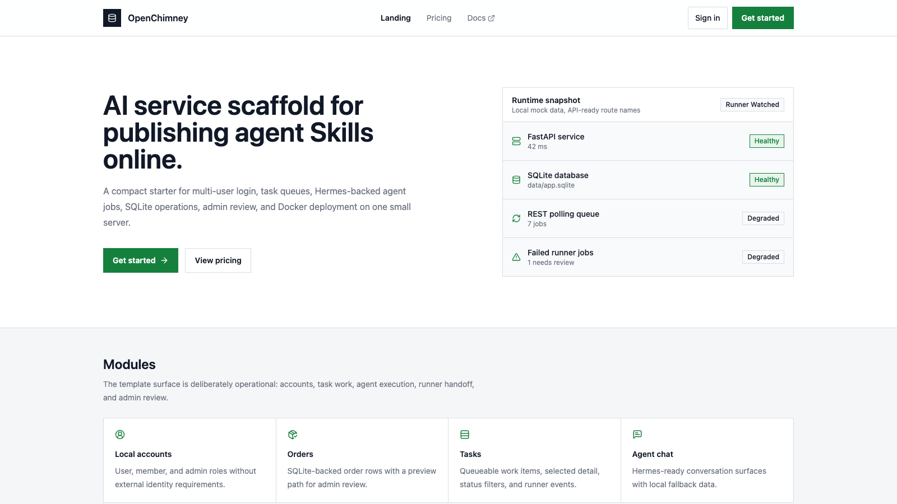
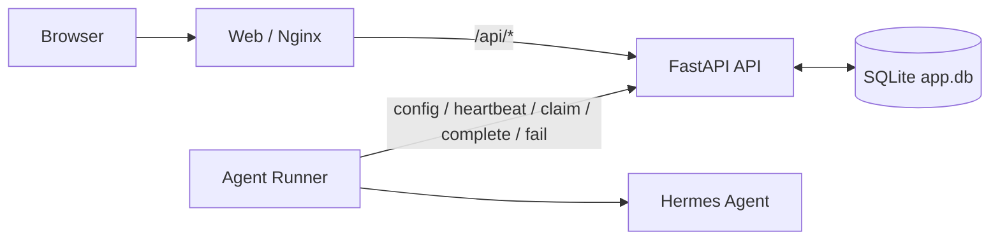

# OpenChimney

OpenChimney is an AI service engineering scaffold. It turns an agent Skill into
a small multi-user online service and ships with the product, backend, task, and
operations layers most agent demos are missing: public pages, local login, a
user console, task management, an admin console, SQLite persistence, Docker
deployment, and a REST-bound AI agent runner.

Use it when you want to publish a Skill as a real web service quickly: users can
sign in, submit tasks, continue task-scoped chats, and get agent results back
through a managed queue. Operators can monitor members, orders, tasks, runner
state, audit logs, and Hermes runtime settings from the admin console. The whole
stack is designed to go online with Docker on one small server.

The name comes from the core boundary: agent work goes through one visible,
auditable chimney. The API owns SQLite, and the runner only talks to the API
through claim, heartbeat, complete, fail, and config endpoints.



## What You Get

- AI service scaffold: product pages, auth, API, database, task queue, runner,
  admin console, and deployment wiring in one repo.
- Skill-to-service path: expose an agent Skill as `ai.agent.v1` jobs that users
  can run from a browser.
- Multi-user product shell: public landing/pricing pages, login, sessions, user
  center, and account/security pages.
- Built-in task system: task lists, task detail, runner events, task-scoped
  conversations, and AI chat.
- Small-scale operations console: admin dashboard, members, orders, audit logs,
  queue state, runner polling, SQLite status, and Hermes runtime settings.
- FastAPI backend: SQLAlchemy models, SQLite schema, auth, members, orders,
  tasks, conversations, admin APIs, and runner APIs.
- Independent agent runner: a REST-polling Python worker for `ai.agent.v1` jobs
  and legacy `ai.chat` compatibility through Hermes Agent.
- Docker launch path: React static web behind Nginx, API-owned SQLite volume,
  and a runner container that does not mount the database.

## Skill To Service Flow

OpenChimney is built around a simple AI service product loop:

1. A user signs in and creates a task or sends a task-scoped chat message.
2. The API stores the task, conversation, and message in SQLite.
3. The API enqueues an `ai.agent.v1` runner job for the configured Skill.
4. The runner claims the job through REST and executes it with Hermes Agent.
5. The runner reports completion or failure back to the API.
6. The API writes the assistant result back into the user-visible conversation.
7. The admin console tracks users, tasks, queue health, runner state, and audit
   events.

That gives you a deployable baseline for turning local agent work into a hosted
service without first rebuilding auth, task queues, admin views, SQLite backup,
or Docker deployment wiring.

## Why OpenChimney

Most agent prototypes stop at a script, a CLI, or a private workflow. The hard
part of publishing a Skill is often the service wrapper: users, sessions, task
state, operator visibility, deployment, and safe data boundaries.

OpenChimney provides that AI service engineering scaffold while keeping the data
path narrow:

- Only the API process reads or writes SQLite.
- The runner never receives a database path or database URL.
- The runner authenticates with `X-Runner-Key` and uses REST only.
- Agent jobs use the `ai.agent.v1` protocol.
- Hermes runtime settings are stored by the API and fetched by the runner at
  startup.
- Toolsets are explicit and restricted; terminal and broad file access should
  stay disabled until a separate sandbox and approval policy exists.

## Architecture



Default Docker shape:

```text
web container
  Nginx serves React and proxies /api to api:8000

api container
  FastAPI owns /data/app.db on the sqlite_data volume

runner container
  polls http://api:8000/api/runner/*
  runs Hermes Agent jobs
  does not mount sqlite_data
```

## Repository Layout

```text
apps/
  api/      FastAPI REST API, SQLite schema, auth, admin, runner endpoints
  web/      React + Vite frontend for public pages, auth, user, and admin
  runner/   Independent Python worker that polls the API over REST
infra/      Docker Compose deployment
docs/       Architecture, API, runner, frontend, deployment, and design notes
scripts/    Docker deploy and SQLite backup helpers
```

## For Coding Agents

OpenChimney is intended to be a practical AI service scaffold for secondary
development by coding agents. Before making changes, read
`.codex/project-memory.md` first; it is the project-local memory for current
architecture decisions, verified commands, and boundary rules.

Non-negotiable boundaries:

- Keep SQLite owned by `apps/api` only.
- Do not give `apps/runner` a database path, database URL, or `sqlite_data`
  mount.
- Keep runner communication on the REST protocol:
  `config -> heartbeat -> claim -> job heartbeat -> complete/fail`.
- Keep browser production calls same-origin through `/api` unless the deployment
  explicitly uses split public origins.
- Treat `ai.agent.v1` as the primary agent job protocol. Preserve legacy
  `ai.chat` compatibility unless removing it is an explicit migration task.
- Keep Hermes and other agent tools behind explicit toolset policy. Do not
  enable terminal, broad file write, or unrestricted browser capabilities by
  default.

High-signal entry points:

```text
apps/web/src/App.tsx              Public pages, auth flows, user/admin consoles
apps/web/src/lib/apiClient.ts     Frontend API client and mock fallback
apps/web/src/types/domain.ts      Frontend domain types
apps/api/app/main.py              FastAPI app factory and router mounting
apps/api/app/models.py            SQLAlchemy schema
apps/api/app/migrations.py        SQLite schema creation and seed data
apps/api/app/routers/auth.py      Email, phone, sessions, password setup
apps/api/app/routers/tasks.py     Tasks and task-message agent enqueue path
apps/api/app/routers/admin.py     Admin overview and Hermes config API
apps/api/app/routers/runner.py    Runner config, heartbeat, claim, complete, fail
apps/runner/app/worker.py         Polling loop and job lifecycle
apps/runner/app/providers.py      Hermes runtime and stub provider
infra/docker-compose.yml          Production service boundary and mounts
```

Recommended verification before handing work back:

```bash
cd apps/api && uv run pytest
cd apps/runner && uv run pytest
cd apps/web && npm test
cd apps/web && npm run build
docker compose --env-file .env -f infra/docker-compose.yml config
```

For deployment-affecting changes, also verify:

```bash
curl http://127.0.0.1:${WEB_PORT:-80}/health
curl http://127.0.0.1:${WEB_PORT:-80}/api/health
docker inspect infra-runner-1 --format '{{json .Mounts}}'
```

The last command should show that the runner has no SQLite volume mount. If
Hermes settings are changed through the admin console, restart the runner so it
fetches the latest DB-backed configuration.

## Quick Start With Docker

Copy the Docker environment template:

```bash
cp .env.docker.example .env
```

Edit at least these values before exposing the stack:

```text
SECRET_KEY
RUNNER_API_KEY
DEFAULT_ADMIN_PASSWORD
SUPER_ADMIN_PASSWORD
HERMES_API_KEY or provider-specific API keys
```

Start the stack:

```bash
./scripts/docker-deploy.sh
```

Equivalent raw command:

```bash
docker compose --env-file .env -f infra/docker-compose.yml up -d --build
```

Health checks:

```bash
curl http://127.0.0.1:${WEB_PORT:-80}/health
curl http://127.0.0.1:${WEB_PORT:-80}/api/health
```

User console is served at `/console`. Super admin access uses the separate
`/admin/login` and `/admin` URLs.

Back up SQLite:

```bash
./scripts/docker-backup-sqlite.sh
```

See [docs/deployment.md](docs/deployment.md) for the 4GB VPS profile, upgrade
commands, backup notes, and scaling path.

## Local Development

Copy the local environment file:

```bash
cp .env.example .env
```

Run the API:

```bash
cd apps/api
uv run uvicorn app.main:app --reload --port 8000
```

Run the web app:

```bash
cd apps/web
npm install
npm run dev
```

Run the agent runner:

```bash
cd apps/runner
uv run sqlite-service-runner run
```

Useful URLs:

```text
API health:  http://127.0.0.1:8000/api/health
Web dev:     http://127.0.0.1:5173
Docker web:  http://127.0.0.1:${WEB_PORT:-80}
```

In Docker, keep `VITE_API_BASE_URL=` empty so the browser calls same-origin
`/api/...` through Nginx. Use a split API origin only when web and API are
deployed on separate public domains.

## AI Job Protocol

OpenChimney uses `ai.agent.v1` as the primary job type. A typical task-chat job
contains:

```json
{
  "runtime": "hermes",
  "task_kind": "ai.chat",
  "instruction": "Reply to the latest user message in this task conversation.",
  "workspace_id": "task-1",
  "session_id": "conversation-2",
  "resume": true,
  "output_schema": "assistant_message.v1",
  "toolsets": [],
  "messages": [
    {
      "role": "user",
      "content": "Hello"
    }
  ]
}
```

The runner completes the job through the API. The API then writes the assistant
message back to the conversation and updates task state.

## Hermes Runtime Configuration

The admin settings page stores Hermes Agent runtime settings in SQLite through:

```text
GET /api/admin/hermes-config
PUT /api/admin/hermes-config
```

The runner fetches its runtime settings through:

```text
POST /api/runner/config/hermes
```

The admin API does not return the raw API key. The runner-only endpoint can
return it because it is authenticated by `X-Runner-Key`.

After changing Hermes settings in the admin console, restart the runner:

```bash
docker compose --env-file .env -f infra/docker-compose.yml restart runner
```

## Testing

Run backend tests:

```bash
cd apps/api
uv run pytest
```

Run runner tests:

```bash
cd apps/runner
uv run pytest
```

Run web tests and build:

```bash
cd apps/web
npm test
npm run build
```

## Documentation

- [Architecture](docs/architecture.md)
- [API](docs/api.md)
- [Runner](docs/runner.md)
- [Frontend](docs/frontend.md)
- [Deployment](docs/deployment.md)
- [Design references](docs/design/README.md)

## Project Status

OpenChimney is an early project template. Before publishing a public repository,
add a license file, replace development secrets, and review the default Hermes
toolset policy for your deployment environment.
